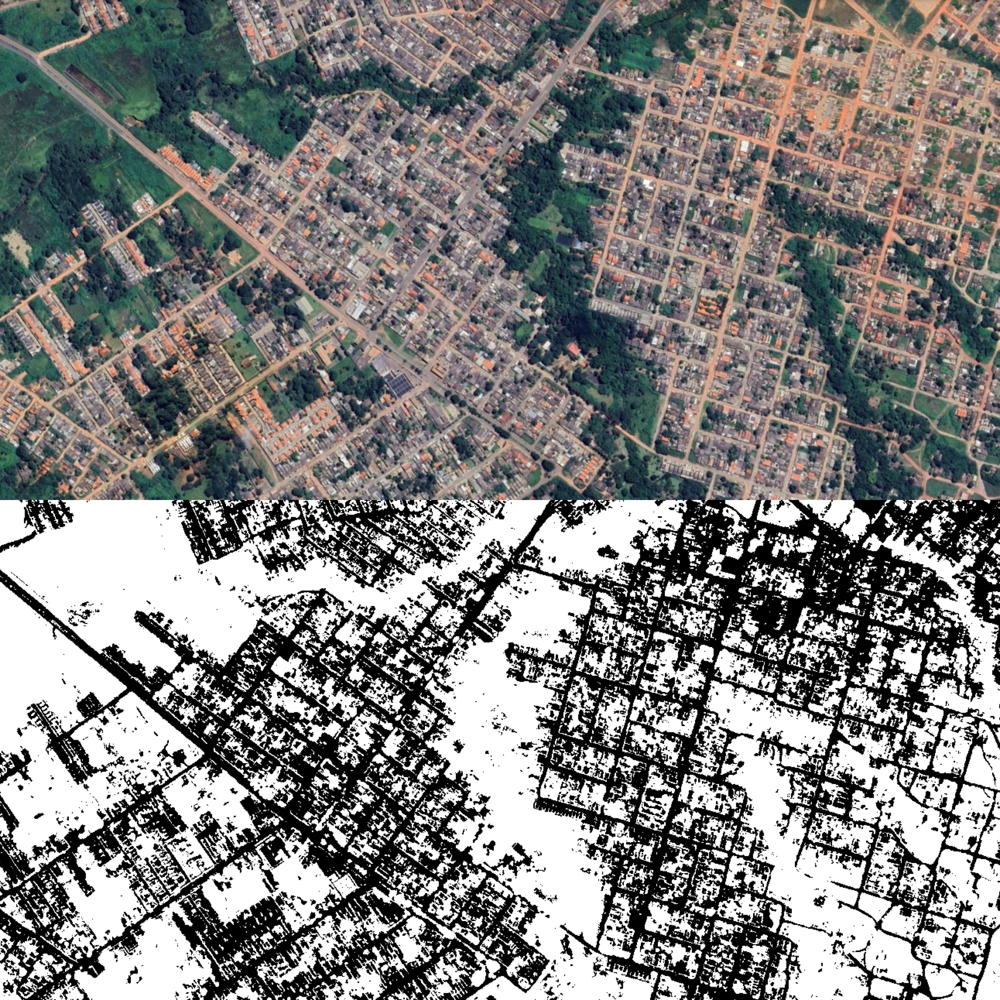
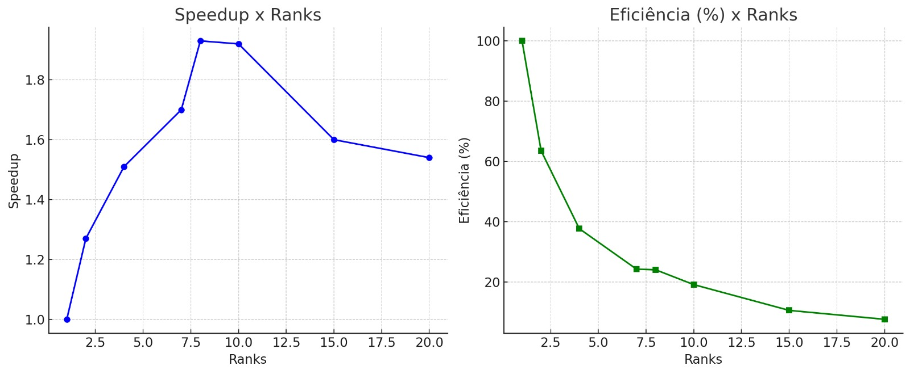

# Projeto_ProgParalela
## Identificador paralelo de estradas em imagens de satélite
## 1. Introdução
Este projeto tem como objetivo o processamento paralelo de imagens geoespaciais no formato .tif, por meio do uso da biblioteca MPI (Message Passing Interface). A solução foi projetada para funcionar em ambientes distribuídos ou com múltiplos núcleos, visando otimizar o tempo de execução e o uso de recursos computacionais. A imagem de entrada é dividida em blocos horizontais, que são distribuídos entre os diferentes processos MPI. Cada processo realiza a leitura parcial da imagem, converte-a para escala de cinza (caso tenha três ou mais bandas), aplica uma limiarização binária inversa para realçar bordas e salva o resultado individualmente. Por fim, os blocos processados são reunidos utilizando uma redução distribuída (redução binária entre os ranks), reconstruindo a imagem final no processo de rank 0. O resultado final é salvo no formato .png, contendo as bordas detectadas em toda a imagem original. O código foi desenvolvido com foco em desempenho e escalabilidade, sendo ideal para processar imagens satelitais ou científicas de grande porte, aproveitando o poder do processamento paralelo com MPI.

### 1.1. Objetivo
Avaliar o desempenho do programa Producao.py ao processar um arquivo .tif de 12 GB (junção de uma mesma imagem várias vezes para gerar uma desse tamanho), utilizando execução serial e paralela com MPI. O objetivo é determinar o tempo médio, speedup e eficiência para diferentes quantidades de ranks, identificando o ponto ótimo entre desempenho e custo computacional.

## 2. Desafios da Solução

### 2.1. Conversão de arquivo .tif para GrayScale

- Desafio:
  O formato .tif com múltiplos canais representa imagens com componentes Red, Green, Blue e possivelmente Alpha (transparência). Para convertê-la para uma imagem de duas dimensões em escala de cinza, é necessário aplicar uma transformação que reduza os canais RGB em um único canal de intensidade.

- Solução adotada:
  A função processar_linhas_img() converte os dados RGB (bandas 1 a 3) para escala de cinza utilizando OpenCV. Em seguida, é aplicada uma limiarização binária inversa (cv2.THRESH_BINARY_INV) com valor de corte 120. O objetivo é destacar possíveis traços como estradas, realçando áreas escuras na imagem. A saída de cada processo MPI é um conjunto de blocos salvos como imagens .png.

### 2.2. Divisão de trabalho MPI

- Desafio:
  O uso da biblioteca MPI permite distribuir o carregamento e processamento da imagem entre vários processos. Esse modelo de paralelismo é especialmente útil para imagens de grande dimensão, otimizando tempo e uso da CPU.

- Solução adotada:
  O código inicializa o MPI com mpi4py, e cada processo recebe um rank. A imagem é dividida em 128 blocos horizontais de mesmo tamanho, utilizando uma janela (rasterio.windows.Window) para leitura parcial. Cada processo MPI verifica quais blocos são de sua responsabilidade com base na fórmula bloco_id % size == rank. Com isso, evita-se comunicação excessiva entre processos e cada rank trabalha de forma autônoma.

### 2.3. Nível de Complexidade

- Desafio:
  A solução exige domínio sobre:
    - Processamento de imagens multidimensionais
    - Programação paralela com MPI
    - Sincronização de processos
    - Manipulação eficiente de arquivos grandes
A combinação dessas áreas torna o projeto desafiador, demandando planejamento e conhecimento técnico sólido.

Solução adotada:
  O código lida com vários níveis de complexidade, como:
    - Leitura de arquivos grandes com múltiplos canais
    - Divisão eficiente da imagem entre processos MPI
    - Tratamento de erros na leitura com try/except
    - Coleta e ordenação dos blocos processados para reconstrução da imagem final

### 2.4. Otimização do uso de memória RAM

- Desafio:
  Durante o processamento de grandes imagens, é fundamental evitar o carregamento de toda a imagem na memória de uma só vez, pois isso pode causar estouro de memória (Out of Memory).

- Solução adotada:
  A imagem não é carregada completamente na memória. Em vez disso, são usadas janelas de leitura (rasterio.windows.Window) para ler apenas o bloco correspondente às linhas atribuídas ao processo. Isso permite um processamento em partes, ideal para imagens grandes. Além disso, o uso de blocos menores (128 blocos fixos) evita sobrecarga de RAM mesmo em sistemas com menos recursos.

### 2.5. Entendimento do problema de segmentação

- Desafio:
  Em algumas aplicações, além da conversão para escala de cinza, é necessário segmentar áreas de interesse na imagem. Isso pode ser feito com:
    - Espaço de cor HSV: separa cor, saturação e intensidade, úil para destacar regiões específicas.
    - Limiarização (Thresholding): converte a imagem em preto e branco com base em um valor de corte, úil para detecção de bordas ou regiões específicas.

- Solução adotada:
  A segmentação é realizada utilizando a técnica de limiarização binária inversa (cv2.THRESH_BINARY_INV), aplicada à imagem em escala de cinza. Esse método é leve, rápido e eficaz para destacar bordas e áreas relevantes como estradas em imagens de satélite. 

### 2.6. Redução Distribuída da Imagem Final

- Desafio:
  Em sistemas distribuídos com MPI, a junção dos resultados processados por diferentes ranks em um único arquivo final é um desafio importante.

- Solução adotada:
  Cada processo salva os blocos de imagem que processou localmente. Após o processamento, cada rank envia seus blocos (id + imagem) para outros ranks seguindo uma estratégia de redução binária. O rank 0 realiza a concatenação vertical (np.vstack) dos blocos em ordem crescente de ID e salva a imagem final com cv2.imwrite.

## 3. Ferramentas utilizadas

### 3.1. Linguagem

Python: escolhida pela ampla disponibilidade de bibliotecas de processamento de imagem, facilidade de uso e compatibilidade com bibliotecas MPI via mpi4py.

### 3.2. Bibliotecas

- rasterio: Leitura de imagens .tif, especialmente com dados georreferenciados
- opencv (cv2): Manipulação de imagens, conversão de formatos, limiarização
- numpy: Operações matriciais de alto desempenho
- os: Navegação e manipulação de arquivos e diretórios
- time: Medição de tempo de execução
- mpi4py: Comunicação entre processos MPI em Python
- gc: Liberação explícita de memória para evitar acúmulo excessivo de objetos grandes

### 3.3. Link do Drive com as Imagens de Sátelite
https://drive.google.com/drive/folders/1v37kY_IqCXy3aOPpUgIfEd7DnQJSroXj 

## 4. Como funciona o programa?

### Fluxo de Execução:

1. Inicialização com MPI:
   O programa inicia com mpi4py, detecta o número de processos e atribui um rank a cada um.

2. Leitura da imagem (todos os ranks):
   Cada processo lê a imagem .tif em blocos parciais (com rasterio.windows.Window), conforme seu rank.

3. Processamento paralelo:
   Cada processo MPI:
    - Converte sua parte para escala de cinza com OpenCV (se aplicável).
    - Aplica limiarização binária inversa.
    - Salva os blocos como imagens .png.

4. Redução distribuída:
   Utilizando uma estratégia de redução binária entre pares (rank ^ etapa), todos os blocos processados são enviados e reunidos no rank 0.

5. Montagem da imagem final:
   O rank 0 ordena os blocos por ID, concatena verticalmente e salva a imagem final com OpenCV
   - Imagem Original X Imagem Final 

## 5. Análise Crítica das Soluções Implementadas 
### 5.1. Primeira Versão - Envio direto ao Mestre
Na primeira versão, cada processo responsável por um bloco aplicava a segmentação (conversão para escala de cinza e limiarização simples) e enviava o resultado diretamente para o processo mestre (rank 0), que por sua vez reunia todos os blocos e montava a imagem final em memória. Essa abordagem funcionou corretamente, porém apresentou resultados de desempenho insatisfatórios. Embora o paralelismo estivesse tecnicamente correto, a execução serial do mesmo código se mostrou mais eficiente. O principal motivo para isso foi o overhead de comunicação MPI. A constante troca de mensagens entre os processos e o mestre — enviando e recebendo dados de imagem — acabou consumindo mais tempo do que o ganho esperado com o paralelismo. Além disso, o processamento realizado em cada bloco era muito simples, o que não justificava o uso de paralelismo distribuído, já que os custos fixos de inicialização e comunicação acabavam sendo mais altos que o tempo do próprio processamento. Outro problema crítico foi a concentração do trabalho final no processo mestre, que ficou encarregado de reunir todos os blocos e construir a imagem. Esse modelo centralizado criou um ponto de estrangulamento, reduzindo a escalabilidade e anulando os ganhos obtidos com múltiplos processos.

### 5.2. Segunda Versão - Escrita de blocos em disco
Na tentativa de otimizar a coleta dos blocos e diminuir o custo de comunicação entre processos, uma segunda abordagem foi desenvolvida. Nesta versão, cada processo passou a salvar os blocos processados como imagens individuais em disco. O processo mestre (rank 0), ao final da execução, lia esses blocos e os empilhava verticalmente para formar a imagem final Apesar de parecer mais leve em termos de comunicação MPI, essa abordagem introduziu um novo gargalo: o excesso de operações de leitura e escrita em disco. Com dezenas ou centenas de blocos sendo escritos e lidos, o sistema de arquivos se tornou o principal limitador de desempenho. Além disso, o tempo total continuou superior à versão serial, confirmando que o paralelismo, nesta aplicação, não foi eficiente nem justificável. Adicionalmente, observamos que após aproximadamente 6 ou 7 processos, o desempenho não melhorava mais, mesmo aumentando o número de processos MPI. Isso indicou uma saturação do paralelismo, típica de aplicações onde o custo de I/O ou comunicação supera o custo computacional real.

### 5.3. Versão Final - Paralelização com MPI otimizada via Escrita de blocos + Redução binária
Na terceira versão do projeto, mantivemos a abordagem de salvar os blocos processados em disco, mas introduzimos uma técnica mais robusta de redução distribuída binária entre os ranks MPI, com o objetivo de melhorar a escalabilidade e diminuir a sobrecarga de comunicação. Cada processo continua responsável por processar uma fração da imagem original .tif (dividida em 128 blocos horizontais). Após o processamento, os blocos são salvos em disco e organizados por cada processo. Ao final, é realizada uma coleta hierárquica (usando XOR entre ranks, estratégia binária), o que evita concentração de tráfego no rank 0 até os momentos finais da execução. Essa etapa reduz progressivamente os dados de todos os ranks até que o rank 0 possa reconstruir a imagem completa e salvá-la como .png.

### Conclusão
As duas primeiras tentativas de paralelização com MPI apresentaram desempenho inferior à execução sequencial. Isso ocorreu devido à sobrecarga de comunicação entre os processos, à baixa complexidade computacional por bloco de dados, ao gargalo de entrada e saída causado por múltiplos acessos concorrentes ao disco, à concentração excessiva de tarefas no processo mestre (rank 0) e à saturação do desempenho com o aumento do número de processos, o que evidenciou os limites da escalabilidade do modelo utilizado.
De modo geral, os testes mostraram que, da forma como foi inicialmente aplicada, a paralelização com MPI não trouxe ganhos práticos de desempenho. Pelo contrário, tornou a execução mais lenta e custosa. Para alcançar resultados mais eficazes, seria necessário aumentar a complexidade das operações paralelizadas, otimizar o gerenciamento de entrada e saída e repensar a estratégia de paralismo adotada — considerando, por exemplo, o uso de abordagens baseadas em memória compartilhada, como multithreading, ou frameworks mais adequados a tarefas com alta demanda de I/O.
Em contrapartida, a versão final da implementação representou um avanço significativo em relação às anteriores. Ela conseguiu combinar uma divisão equilibrada das tarefas entre os processos, o uso eficiente de blocos com janelas de processamento (windowing), uma escrita controlada em disco para evitar conflitos de I/O e uma comunicação escalável entre os processos por meio de redução binária. Embora ainda dependa da escrita em disco, a adoção de uma redução hierárquica entre os ranks evitou a sobrecarga central no processo mestre e proporcionou uma melhora na escalabilidade horizontal. Dessa forma, a execução tornou-se mais viável e eficiente, especialmente em ambientes com 4, 8 ou até 16 núcleos de processamento

## 7. Anotação dos Testes de tempo de execução - Producao3.py (Código Final)

### 7.1. Tabela de SpeedUp e Eficiência
| Ranks | Tempo Médio (s) | Speedup | Eficiência (%) |
|-------|------------------|---------|----------------|
| 1     | 90.62            | 1.00    | 100.00         |
| 2     | 71.59            | 1.27    | 63.55          |
| 4     | 59.97            | 1.51    | 37.75          |
| 7     | 53.24            | 1.70    | 24.32          |
| 8     | 46.92            | 1.93    | 24.12          |
| 10    | 47.25            | 1.92    | 19.20          |
| 15    | 56.49            | 1.60    | 10.66          |
| 20    | 58.81            | 1.54    | 7.70           |

### Gráfico de SpeedUp e Eficiência

### 7.2. Análise de Desempenho
Observações
-  O Speedup cresce conforme aumentam os ranks, mas de forma cada vez menos eficiente (lei dos retornos decrescentes).
- A Eficiência cai à medida que mais processos são usados, indicando sobrecarga de paralelismo ou limites do hardware/software para essa tarefa específica.

Análise por Faixa de Ranks
- 1 a 4 Ranks (boa escalabilidade):
    Aceleração significativa do tempo de execução.
    Eficiência cai de 100% para 37,75%, indicando os primeiros sinais de overhead.

- 5 a 8 Ranks (eficiência em queda):
    Ganhos marginais.
    O tempo melhora, mas a eficiência se estabiliza abaixo de 25%.
    Boa relação custo-benefício termina em torno de 8 ranks.

- 10 a 20 Ranks (saturação e retrocesso):
    Com 10 ou mais processos, o tempo não melhora significativamente.
    A eficiência cai para menos de 20%, indicando desperdício de recursos.
    Com 20 ranks, a eficiência é inferior a 8%

### 7.3. Conclusão
Com base nos testes realizados, observou-se que o speedup aumenta à medida que se adicionam mais processos, porém esse crescimento satura rapidamente, evidenciando os limites impostos pela Lei de Amdahl — ou seja, há porções do código que não podem ser paralelizadas, restringindo o ganho total. A eficiência do sistema cai progressivamente com o aumento do número de ranks, indicando um uso menos eficaz dos recursos computacionais. Do ponto de vista técnico, o melhor custo-benefício foi obtido com 4 ranks, que proporcionaram um speedup de 1.51 com eficiência de aproximadamente 37%, representando o melhor equilíbrio entre tempo e uso de recursos. Já o melhor desempenho absoluto foi alcançado com 8 ranks, resultando no menor tempo de execução (46.92 segundos), embora com eficiência reduzida para cerca de 24%. A partir de 10 ranks, os ganhos em desempenho tornam-se mínimos ou inexistentes, com queda acentuada de eficiência, o que torna seu uso pouco vantajoso. Como recomendação prática: para balancear desempenho e economia de recursos, o ideal é usar 4 ranks; se o objetivo for reduzir o tempo de execução ao máximo, utilizar até 8 ranks pode ser justificável. Ultrapassar esse número não traz benefícios práticos e pode representar desperdício computacional. Em ambientes com restrições de CPU ou memória, o uso de 3 ou 4 ranks é o mais indicado.

## 8. O que mudou durante o projeto?
- A substituição da segmentação com DeepLabV3+ por uma abordagem baseada em thresholding simples com OpenCV;
- Nova estratégia de divisão de blocos fixos (128 blocos) e distribuição por bloco_id % size;
- Eliminação de comunicação direta do mestre com os escravos (não há mais comm.send dos blocos);
- Inclusão de uma etapa de redução distribuída binária para montagem da imagem final;

## 9.Resultados Esperados
Redução de até 50% no tempo de processamento para imagens grandes (comparado com versão sequencial)
Conversão precisa das imagens RGBA para Grayscale
Segmentação clara (quando aplicada)
Baixo uso de memória RAM (evitando crashes)
Código modular e de fácil manutenção

## 10.Conclusão
Este projeto demonstrou como o uso combinado de processamento paralelo com MPI e técnicas eficientes de manipulação de imagens pode acelerar significativamente o tratamento de grandes arquivos TIFF de satélite. A abordagem adotada, que divide a imagem em blocos para processamento distribuído, permite o aproveitamento completo dos recursos computacionais disponíveis, mesmo em ambientes com máquinas modestas. A escolha por uma segmentação simples baseada em limiarização, aliada à leitura seletiva por janelas (windowing) com Rasterio, garantiu baixo consumo de memória e alta escalabilidade do sistema. A redução binária distribuída para a agregação final dos blocos processados evidenciou uma solução robusta e eficiente para montagem da imagem segmentada. Além de que utilização de MPI via Python, aliada a bibliotecas especializadas como Rasterio e OpenCV, permite alcançar alta performance mesmo em máquinas com recursos limitados. Assim, o projeto reforça a importância da combinação entre paralelismo, otimização de recursos e algoritmos adequados para aplicações de análise de imagens em larga escala, contribuindo para o avanço de técnicas em geoprocessamento e sensoriamento remoto.
 

