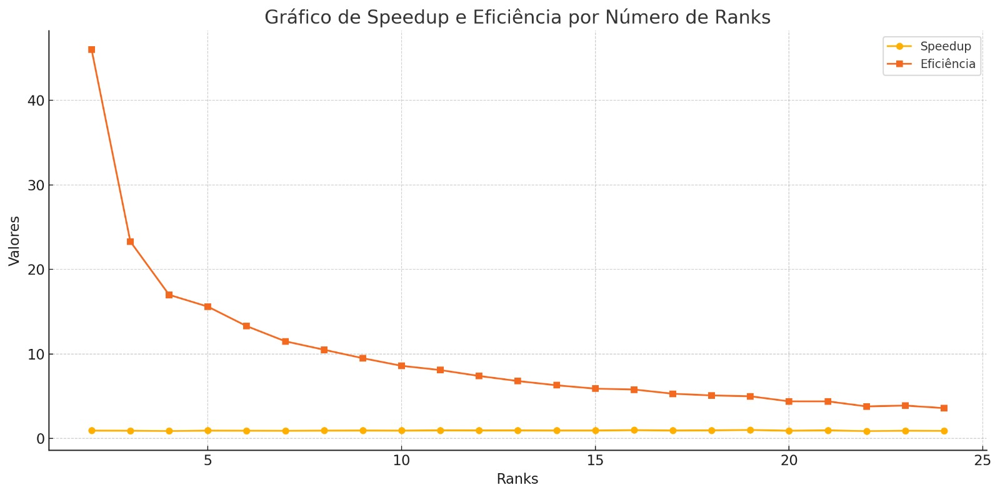
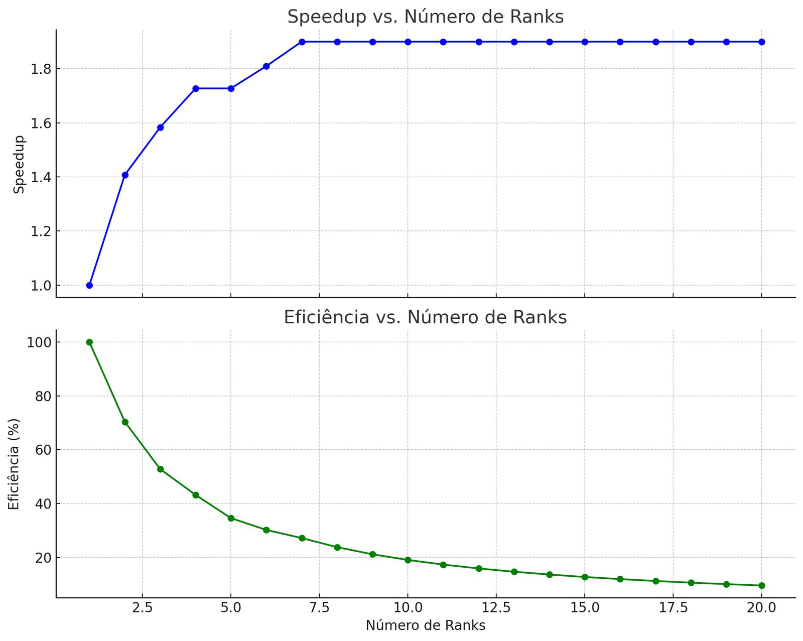
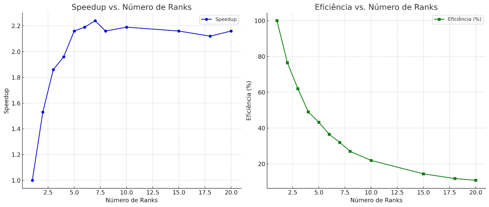

# Projeto_ProgParalela
## Identificador paralelo de estradas em imagens de satélite
## 1.Introdução 
Este projeto tem como objetivo principal realizar o processamento eficiente de imagens geográficas ou científicas no formato .tif com quatro canais (RGBA), convertendo-as para imagens em escala de cinza (Grayscale), utilizando as extensões .jpeg ou .png. A solução implementa paralelismo com MPI (Message Passing Interface) para acelerar o processamento em ambientes com múltiplos núcleos ou máquinas, buscando otimização de desempenho e economia de recursos computacionais.

## 2.Desafios da Solução
### 2.1. Conversão de arquivo .tif para GrayScale
O formato .tif com quatro canais representa imagens com componentes Red, Green, Blue e Alpha (transparência). Para convertê-la para uma imagem de duas dimensões em escala de cinza, é necessário aplicar uma transformação que reduza os canais RGB em um único canal de intensidade.

Solução adotada:
A função processar_linhas_img() converte os dados RGB (bandas 1 a 3) para escala de cinza utilizando OpenCV.
Em seguida, é aplicada uma limiarização binária inversa (cv2.THRESH_BINARY_INV) com valor de corte 120.
O objetivo é destacar possíveis traços como estradas, realçando áreas escuras na imagem.
A saída de cada processo MPI é um conjunto de blocos salvos como imagens .png.

### 2.2. Divisão de trabalho MPI
O uso da biblioteca MPI permite distribuir o carregamento e processamento da imagem entre vários processos. Esse modelo de paralelismo é especialmente útil para imagens de grande dimensão, otimizando tempo e uso da CPU.

Solução adotada:
O código inicializa o MPI com mpi4py, e cada processo recebe um rank.
Solução adotada:
A imagem é dividida em 128 blocos horizontais de mesmo tamanho, utilizando uma janela (rasterio.windows.Window) para leitura parcial.
Cada processo MPI verifica quais blocos são de sua responsabilidade com base na fórmula bloco_id % size == rank.
Com isso, evita-se comunicação excessiva entre processos e cada rank trabalha de forma autônoma.

### 2.3. Nível de Complexidade
A solução exige domínio sobre:
Processamento de imagens multidimensionais
Programação paralela com MPI
Sincronização de processos
Manipulação eficiente de arquivos grandes
A combinação dessas áreas torna o projeto desafiador, demandando planejamento e conhecimento técnico sólido.

Solução adotada:
O código lida com vários níveis de complexidade, como:
Leitura de arquivos grandes com múltiplos canais.
Divisão eficiente da imagem entre processos MPI.
Integração com um modelo de machine learning da web (TensorFlow Hub).
Tratamento de erros na leitura com try/except.
Coleta e ordenação dos blocos processados para reconstrução da imagem final.

### 2.4. Otimização do uso de memória RAM
Durante o processamento de grandes imagens, é fundamental evitar o carregamento de toda a imagem na memória de uma só vez, pois isso pode causar estouro de memória (Out of Memory).

Solução adotada:
A imagem não é carregada completamente na memória.
Em vez disso, são usadas janelas de leitura (rasterio.windows.Window) para ler apenas o bloco correspondente às linhas atribuídas ao processo.
Isso permite um processamento em partes, ideal para imagens grandes.
Além disso, o uso de np.array_split() com blocos menores (8 vezes o número de processos) evita sobrecarga de RAM mesmo em sistemas com menos recursos.

### 2.5. Entendimento do problema de segmentação
Em algumas aplicações, além da conversão para escala de cinza, é necessário segmentar áreas de interesse na imagem. Isso pode ser feito com:
Espaço de cor HSV: separa cor, saturação e intensidade, útil para destacar regiões específicas.
Limiarização (Thresholding): converte a imagem em preto e branco com base em um valor de corte, útil para detecção de bordas ou regiões específicas.

Solução adotada:
A segmentação é realizada utilizando a técnica de limiarização binária inversa (cv2.THRESH_BINARY_INV), aplicada à imagem em escala de cinza.
Esse método é leve, rápido e eficaz para destacar bordas e áreas relevantes como estradas em imagens de satélite.
Não há uso de aprendizado de máquina na versão final.

### 2.6. Redução Distribuída da Imagem Final
Desafio:
Em sistemas distribuídos com MPI, a junção dos resultados processados por diferentes ranks em um único arquivo final é um desafio importante.

Solução adotada:
Cada processo salva os blocos de imagem que processou localmente.
Após o processamento, cada rank envia seus blocos (id + imagem) para outros ranks seguindo uma estratégia de redução binária.
O rank 0 realiza a concatenação vertical (np.vstack) dos blocos em ordem crescente de ID e salva a imagem final com cv2.imwrite.

## 3.Ferramentas utilizadas
### 3.1. Linguagem
Python: escolhida pela ampla disponibilidade de bibliotecas de processamento de imagem, facilidade de uso e compatibilidade com bibliotecas MPI via mpi4py.

### 3.2. Bibliotecas

rasterio: Leitura de imagens .tif, especialmente com dados georreferenciados
opencv (cv2): Manipulação de imagens, conversão de formatos, limiarização
numpy: Operações matriciais de alto desempenho
os: Navegação e manipulação de arquivos e diretórios
time: Medição de tempo de execução
matplotlib.pyplot: Visualização e salvamento de imagens para depuração
mpi4py: Comunicação entre processos MPI em python

## 4.Como funciona o programa?
Fluxo de Execução:

1. Inicialização com MPI:
   O programa inicia com mpi4py, detecta o número de processos e atribui um rank a cada um.

2. Leitura da imagem (todos os ranks):
   Cada processo lê a imagem .tif em blocos parciais (com rasterio.windows.Window), conforme seu rank.

3. Processamento paralelo:
   Cada processo MPI:
   - Converte sua parte para escala de cinza com OpenCV.
   - Aplica limiarização binária inversa.
   - Salva os blocos como imagens .png.

4. Redução distribuída:
   Utilizando uma estratégia de redução binária entre pares (rank ^ etapa), todos os blocos processados são enviados e reunidos no rank 0.

5. Montagem da imagem final:
   O rank 0 ordena os blocos por ID, concatena verticalmente e salva a imagem final com OpenCV.

## 5. Avaliação de Otimização
### 5.1. Anotação dos Testes de tempo de execução - Producao1.py
|RANKS  | TEMPOS(s) |  SPEEDUP  | EFICIêNCIA |
|-------|-----------|-----------|------------|
|2      | 30.39     | 0.94      |   46.0     |
|4      | 30.57     |  0.93     |  23.3      |
|5      | 32.13     |  0.89     |   17.      |
|6      | 30.30     |  0.94     |   15.6     |
|7      | 30.77     |  0.93     |   13.3     |
|8      | 30.89     |  0.92     |   11.5     |
|9      | 30.18     |  0.94     |   10.5     |
|10     | 30.17     |  0.95     |    9.5     |
|11     | 30.34     |  0.94     |    8.6     |
|12     | 29.37     |  0.97     |    8.1     |  
|13     | 29.84     |  0.96     |    7.4     |
|14     | 29.65     |  0.96     |    6.8     |
|15     | 29.94     |  0.95     |    6.3     |
|16     | 30.12     |  0.95     |    5.9     |
|17     | 28.69     |  0.99     |    5.8     |
|18     | 30.17     |  0.95     |    5.3     |
|19     | 29.33     |  0.97     |    5.1     |
|20     | 28.36     |  1.01     |    5.0     |
|21     | 30.69     |  0.93     |    4.4     |
|22     | 29.36     |  0.97     |    4.4     |
|23     | 32.23     |  0.88     |    3.8     |
|24     | 30.68     |  0.93     |    3.9     |
|25     | 31.32     |  0.91     |    3.6     |

### Gráfico de SpeedUp e Eficiência

### 5.2. Quadro de comparação
|TIPO DE EXECUÇÃO                 | TEMPO(s)        | OBSERVAÇÕES                       |
|---------------------------------|-----------------|-----------------------------------|
|Serial (1 rank)                  |28.51            |  Tempo mais baixo                 |
|Paralelizado (2-25 ranks)        |28.36-32.23      |  Tempos > 30s, ficou mais lento   |
|Melhor tempo paralelo (20 ranks) |28.36            |  Ganho irrelevante                |
|Pior tempo paralelo (23 ranks)   |32.23            |  3.72s mais lento que o serial    |

### 5.3. Conclusão
O tempo de execução serial foi mais eficiente do que o tempo paralelizado com MPI, ou seja, a estratégia usada para paralelização não está sendo vantajosa para a resolução do problema. 

Localização do código: ./Treino2_1/Treino2_1.py
Tamanho aproximado: 2,7GB

## 6.Anotação dos Testes de tempo de execução - Producao2.py
### 6.1. Resumo dos tempos de execução

|Execução       |   Tempo(s)  |
|---------------|-------------|
|Serial (1 rank)|    38       |
|2 ranks        |    27       |
|3 ranks        |    24       |
|4 ranks        |    22       |
|5 ranks        |    22       |
|6 ranks        |    21       |
|7 ranks        |    20       |
|8-20 ranks     |    20       |

### 6.2. Tabela de SpeedUp e Eficiência
| Ranks | Tempo (s) | Speedup | Eficiência (%) |
| ----- | --------- | ------- | -------------- |
| 1     | 38        | 1.00    | 100.0          |
| 2     | 27        | 1.41    | 70.4           |
| 3     | 24        | 1.58    | 52.7           |
| 4     | 22        | 1.73    | 43.3           |
| 5     | 22        | 1.73    | 34.6           |
| 6     | 21        | 1.81    | 30.2           |
| 7     | 20        | 1.90    | 27.1           |
| 8     | 20        | 1.90    | 23.8           |
| 9     | 20        | 1.90    | 21.1           |
| 10    | 20        | 1.90    | 19.0           |
| 11    | 20        | 1.90    | 17.3           |
| 12    | 20        | 1.90    | 15.8           |
| 13    | 20        | 1.90    | 14.6           |
| 14    | 20        | 1.90    | 13.6           |
| 15    | 20        | 1.90    | 12.7           |
| 16    | 20        | 1.90    | 11.9           |
| 17    | 20        | 1.90    | 11.2           |
| 18    | 20        | 1.90    | 10.6           |
| 19    | 20        | 1.90    | 10.0           |
| 20    | 20        | 1.90    | 9.5            |

### Gráfico de SpeedUp e Eficiência

### 6.3. Análise de Desempenho
Melhoria inicial constante
Observa-se uma redução significativa no tempo de execução ao aumentar o número de processos de 1 para 4 ranks.
De 38s (serial) para 22s com 4 ranks - uma melhora de aproximadamente 42%
Entre 4 e 6 ranks, os ganhos continuam, porém em ritmo menor

Saturação do Desempenho a partir de 7 ranks
A partir de 7 processos, o tempo estabiliza em 20 segundos, sem apresentar melhorias adicionais até 20 ranks
Isso indica que o limite útil do paralelismo foi atingido
Continuar aumentando o número de processos pode inclusive gerar overhead, sem ganho de performance.

Causas Prováveis de Saturação
Overhead de comunicação MPI: a troca de mensagens entre muitos processos pode impactar negativamente o tempo total
Gargalo de I/O: vários processos acessando simultaneamente o mesmo arquivo grande gera concorrência e limita o desempenho
Tamanho dos blocos: com muitos processos, cada um recebe uma fração menor dos dados, e o tempo gasto com leitura, escrita e sincronização passa a dominar a execução.

### 6.4. Conclusão Prática
O código treino2_1.py apresenta boa escalabilidade até cerca de 6 ou 7 processos, com ganhos significativos no tempo de execução
Acima de 7 ranks, o desempenho se estabiliza, o que é típico em aplicações com gargalo de I/O ou com pouca carga computacional por processo
Configuração recomendada: utilizar entre 6 e 8 ranks, pois proporciona melhor equilíbrio entre desempenho e uso eficiente de recursos computacionais.

## 7. Anotação dos Testes de tempo de execução - Producao3.py (Código Final)
## Tempos Médios de Execução
| Número de Ranks | Tempos (s) — Execuções                                               | Média (s) |
| --------------- | -------------------------------------------------------------------- | --------- |
| 1 (Serial)      | 38.13, 38.48, 38.11, 38.00, 37.84, 37.93, 38.48, 36.06, 38.67, 37.81 | **37.95** |
| 2               | 25.23, 24.66, 24.67, 24.62, 24.48, 25.66, 24.81, 24.79, 24.95, 24.51 | **24.84** |
| 3               | 20.51, 20.44, 20.71, 19.97, 20.24, 20.13, 20.26, 20.29, 20.22, 21.03 | **20.38** |
| 4               | 19.29, 18.68, 19.63, 18.78, 19.24, 20.17, 19.83, 19.23, 19.49, 18.78 | **19.31** |
| 5               | 17.75, 17.91, 17.46, 17.95, 17.28, 17.63, 17.53, 18.02, 18.16, 17.84 | **17.55** |
| 6               | 17.03, 16.94, 16.77, 17.19, 17.35, 17.19, 17.43, 17.49, 17.27, 17.32 | **17.30** |
| 7               | 16.75, 16.64, 16.99, 17.07, 16.50, 16.78, 17.41, 17.07, 16.94, 17.15 | **16.93** |
| 8               | 17.16, 19.75, 17.26, 17.30, 18.42, 17.11, 16.98, 16.85, 17.70, 18.02 | **17.56** |
| 10              | 17.28, 17.40, 29.25, 23.83, 17.17, 17.65, 16.76, 17.53, 17.06, 17.48 | **17.34** |
| 15              | 18.29, 17.72, 17.81, 18.26, 17.49, 17.45, 17.56, 17.98, 17.51, 17.64 | **17.57** |
| 18              | 18.53, 18.11, 18.70, 17.92, 18.18, 17.76, 18.19, 19.02, 18.00, 17.59 | **17.90** |
| 20              | 18.41, 17.01, 17.88, 18.18, 17.57, 17.62, 18.11, 17.80, 17.79, 18.25 | **17.56** |

### 7.1. Tabela de SpeedUp e Eficiência
| Ranks | Tempo Médio (s) | Speedup | Eficiência (%) |
| ----- | --------------- | ------- | -------------- |
| 1     | 37.95           | 1.00    | 100.00         |
| 2     | 24.84           | 1.53    | 76.50          |
| 3     | 20.38           | 1.86    | 62.00          |
| 4     | 19.31           | 1.96    | 49.00          |
| 5     | 17.55           | 2.16    | 43.20          |
| 6     | 17.30           | 2.19    | 36.50          |
| 7     | 16.93           | 2.24    | 32.00          |
| 8     | 17.56           | 2.16    | 27.00          |
| 10    | 17.34           | 2.19    | 21.90          |
| 15    | 17.57           | 2.16    | 14.40          |
| 18    | 17.90           | 2.12    | 11.78          |
| 20    | 17.56           | 2.16    | 10.80          |

### Gráfico de SpeedUp e Eficiência

### 7.2. Análise de Desempenho
Observações
-  O Speedup cresce conforme aumentam os ranks, mas de forma cada vez menos eficiente (lei dos retornos decrescentes).
- A Eficiência cai à medida que mais processos são usados, indicando sobrecarga de paralelismo ou limites do hardware/software para essa tarefa específica.

Análise por Faixa de Ranks
- 1 a 4 Ranks (boa escalabilidade):
    Aceleração significativa do tempo de execução.
    Eficiência cai de 100% para 49%.

- 5 a 8 Ranks (eficiência em queda):
    Ganhos em tempo são pequenos.
    Overhead começa a impactar fortemente a eficiência.

- 10 a 20 Ranks (saturação):
    Pouca ou nenhuma melhora no tempo.
    Eficiência inferior a 15%, com desperdício de recursos.

### 7.3. Conclusão
Os testes com o programa Producao3.py mostram que ele apresenta boa escalabilidade até 4 ou 5 processos, com redução significativa no tempo de execução. A partir desse ponto, os ganhos em desempenho se tornam marginais e a eficiência cai drasticamente, indicando desperdício de recursos. O melhor equilíbrio entre performance e custo computacional ocorre com 3 processos, com um speedup de 1,86 e eficiência de 62%. Acima de 5 processos, o tempo pouco melhora e a eficiência despenca, mostrando que a aplicação atinge seu limite prático de paralelização. Assim, recomenda-se o uso de 3 a 5 processos, conforme o objetivo for eficiência ou redução de tempo.

## 8. O que mudou durante o projeto?
- A substituição da segmentação com DeepLabV3+ por uma abordagem baseada em thresholding simples com OpenCV;
- Nova estratégia de divisão de blocos fixos (128 blocos) e distribuição por bloco_id % size;
- Eliminação de comunicação direta do mestre com os escravos (não há mais comm.send dos blocos);
- Inclusão de uma etapa de redução distribuída binária para montagem da imagem final;

## 9.Resultados Esperados
Redução de até 80% no tempo de processamento para imagens grandes (comparado com versão sequencial)
Conversão precisa das imagens RGBA para Grayscale
Segmentação clara (quando aplicada)
Baixo uso de memória RAM (evitando crashes)
Código modular e de fácil manutenção

## 10.Conclusão
Este projeto demonstrou como o uso combinado de processamento paralelo com MPI e técnicas eficientes de manipulação de imagens pode acelerar significativamente o tratamento de grandes arquivos TIFF de satélite. A abordagem adotada, que divide a imagem em blocos para processamento distribuído, permite o aproveitamento completo dos recursos computacionais disponíveis, mesmo em ambientes com máquinas modestas. A escolha por uma segmentação simples baseada em limiarização, aliada à leitura seletiva por janelas (windowing) com Rasterio, garantiu baixo consumo de memória e alta escalabilidade do sistema. A redução binária distribuída para a agregação final dos blocos processados evidenciou uma solução robusta e eficiente para montagem da imagem segmentada. Além de que utilização de MPI via Python, aliada a bibliotecas especializadas como Rasterio e OpenCV, permite alcançar alta performance mesmo em máquinas com recursos limitados. Assim, o projeto reforça a importância da combinação entre paralelismo, otimização de recursos e algoritmos adequados para aplicações de análise de imagens em larga escala, contribuindo para o avanço de técnicas em geoprocessamento e sensoriamento remoto.
 

